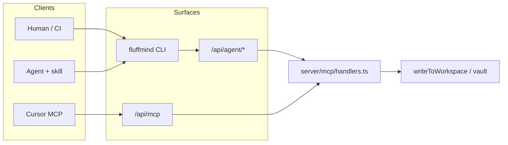

# Agent access — CLI, skill & REST (design)

**Date:** 2026-07-30  
**Status:** draft (awaiting user review)  
**Depends on:** [[../../../prd/PRD-036-mcp-workspace-tokens|PRD-036]] (shipped), [[../../../foam/decisions/ADR-010-mcp-workspace-tokens|ADR-010]]  
**Follow-up docs (implementation):** PRD-037, ADR-011 (to be written with the plan)

## Problem

MCP is useful for native tool calling in Cursor-like clients, but it is **expensive in
context**. Operators and agents also need a lighter path: shell/CI commands and a
Cursor skill that shells out to a CLI. Auth for remote agents already exists as
workspace Bearer tokens (`fm_mcp_…`), but naming and APIs are MCP-only.

## Goals

1. **CLI-first for ops + agents** — humans/scripts use `fluffmind`; agents follow a
   skill that invokes the CLI. MCP remains available for native tools.
2. **Unified agent tokens** — one token model for MCP HTTP, agent REST, and CLI
   (generalize PRD-036; keep hash-only, read/write scope, workspace binding).
3. **REST mirror of MCP tools** — `/api/agent/*` calls the same `handlers.ts` as MCP.
4. **Installable CLI + skill** — install script, Nix flake package, skill copyable
   outside the monorepo.

## Non-goals (v1)

- Compiled single binary (Go/Bun) — deferred; TypeScript package first
- Multi-workspace discovery / user-level tokens
- Session-cookie auth on `/api/agent/*`
- Rate limiting, OAuth device flow, fine-grained per-tool scopes
- Replacing or removing MCP

## Architecture



**Invariant (DESIGN.md / ADR-002):** all writes go through `writeToWorkspace`. Clients
are thin HTTP callers.

## Token migration (from PRD-036)

| Today (shipped) | Target |
| --------------- | ------ |
| `workspace_config.mcp_enabled` | Rename column to `agent_enabled` in one migration (no dual columns) |
| `workspace_mcp_token` | Rename table to `workspace_agent_token` in the same migration |
| Prefix `fm_mcp_` | New issuances `fm_agent_<8-hex>_<secret>` |
| Owner APIs `/api/workspaces/mcp` | Move to `/api/workspaces/agent` in the same release (no long-lived owner aliases) |
| Settings section « MCP » | « Agents » (MCP + CLI snippets) |
| Streamable HTTP `/api/mcp` | **Unchanged path** — still the MCP transport; auth accepts agent tokens |

**Compatibility**

- Bearer resolution accepts **both** `fm_agent_…` and `fm_mcp_…` against the same
  hash table after migration.
- New tokens are issued only as `fm_agent_…`.
- If `agentEnabled` is false → 403 even with a valid hash (same gate as today).

**Auth matrix**

| Surface | Auth |
| ------- | ---- |
| `/api/mcp` | Bearer agent token **or** session (unchanged fallback order) |
| `/api/agent/*` | Bearer agent token **only** |
| Owner CRUD | Session + owner role |

## REST `/api/agent/*`

JSON mirror of MCP tools; catch-all note ids like existing `/api/notes`.

| Method | Path | MCP tool | Min scope |
| ------ | ---- | -------- | --------- |
| GET | `/api/agent/workspace` | `get_workspace` | read |
| GET | `/api/agent/notes/search?q=&limit=` | `search_notes` | read |
| GET | `/api/agent/notes/:id` | `read_note` | read |
| PUT | `/api/agent/notes/:id` | `write_note` `{ content }` | write |
| GET | `/api/agent/notes/:id/backlinks` | `list_backlinks` | read |
| GET | `/api/agent/graph` | `get_graph` | read |
| POST | `/api/agent/tasks` | `create_task` `{ content, noteId? }` | write |

Errors use existing H3-style `{ statusCode, message }`. Writes respect scope,
`VAULT_READONLY`, and P7 workspace locks. No URL versioning in v1.

## CLI (`packages/cli`)

- Package: `@fluffmind/cli`, binary name `fluffmind`
- Runtime v1: Node/TypeScript in the monorepo; compiled binary later
- Config precedence: flags > env > `~/.config/fluffmind/config.json`
  - `FLUFFMIND_URL` — instance base URL
  - `FLUFFMIND_TOKEN` — `fm_agent_…` (or legacy `fm_mcp_…`)

Commands:

```text
fluffmind whoami
fluffmind search <query> [--limit N]
fluffmind read <note-id>
fluffmind write <note-id> [--file path | --stdin]
fluffmind backlinks <note-id>
fluffmind graph
fluffmind task "<text>" [--note inbox/tasks]
fluffmind config set|get|path
```

- Default stdout: JSON (agent/CI friendly); `--pretty` for humans
- Exit codes: `0` ok, `1` business error, `2` auth/config, `3` network
- No monorepo/git dependency at runtime — HTTP client only

## Skill

- Source of truth: `skills/fluffmind/SKILL.md` (repo root `skills/`)
- Distributable: docs explain copying that folder into the consumer’s agent skills path
- Content: when to use CLI vs MCP; setup (`install`, URL, token); command examples;
  never invent APIs; never commit tokens

## Packaging & docs

- `scripts/install-cli.sh` for curl-pipe install → npm global or `~/.local/bin`
- Extend root `flake.nix` with a `fluffmind-cli` package (keep existing `devShell`)
- Docs: `apps/docs/guide/` agents page (MCP | CLI | skill); Settings UI snippets
- Update `DESIGN.md` MCP section → broader « Agent surfaces »
- PRD-037 + ADR-011 during implementation planning (ADR-010 remains accepted;
  partially superseded on naming)

## Testing

- Unit: Bearer resolve for `fm_agent_` + compat `fm_mcp_`
- Unit/integration: `/api/agent/*` scope enforcement (read cannot write)
- CLI: HTTP client tests with mocked server (no live instance required)

## Implementation order (suggested)

1. Token rename + compat layer + owner API/UI copy
2. `/api/agent/*` routes on existing handlers
3. `packages/cli` + install script + flake package
4. Skill + docs + Settings snippets

## Decisions log (brainstorming)

| Topic | Choice |
| ----- | ------ |
| Role of trio | CLI for ops/humans; skill → CLI; MCP kept for native tools |
| Tokens | Generalize to agent tokens (not MCP-only, not separate CLI tokens) |
| HTTP for CLI | Dedicated REST `/api/agent/*` mirroring tools |
| CLI delivery | TS package v1; compiled binary later |
| Skill | In-repo SoT + installable/copyable outside monorepo |
| Calendar | PRD-036 already on main → new PRD on top (not expand pre-ship) |
